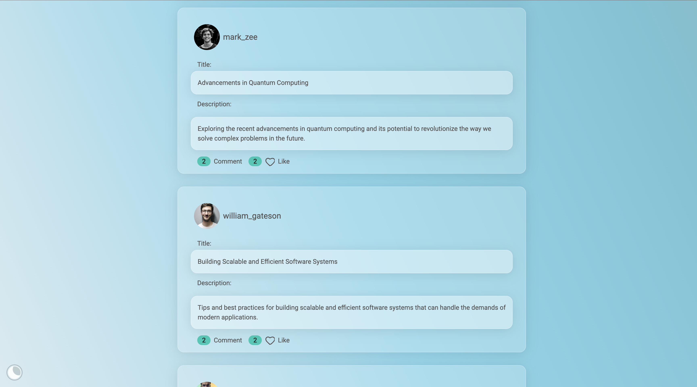

# TechNewZ

## Description

Welcome to the repository for TechNewZ, a feature-rich web application developed as a final project.

## Features

Community Blog Functionality: Tech Newzz includes a community blog feature, allowing users to share their thoughts and engage with others.

Secure Registration Process: The registration process is designed for security and efficiency. A REST API connects the frontend to the Postgres database, ensuring data integrity. Passwords are securely hashed using bcrypt, and schema validation is enforced with Zod.

Session Management: After login, a session token is created, providing users with a seamless experience without needing to log in every time. The session token is automatically deleted after 24 hours for security.

Personalized Profiles: Registered users can create personalized profiles with image storage handled by Cloudinary.

Access Control: Authenticated users gain access to profile, news, and community pages. Unauthorized attempts to access these pages are redirected to the sign-in page.

News Section: News content is fetched using a REST API, and animations are implemented using Framer Motion.

User Engagement: Users can express engagement by liking news articles, with likes recorded in the database. Unliking an article removes the corresponding entry.

Comment Section: Each post has a comment section, promoting user interaction and discussion.

Community Page: The community page showcases user-generated blog posts. Users can engage by liking posts and leaving comments.

Theme Switcher: A theme switcher feature is implemented for enhanced user customization and experience.

## Technologies Used

- [Next.js](https://nextjs.org/)
- [React](https://reactjs.org/)
- JavaScript
- HTML/CSS
- [Node.js](https://nodejs.org/) (for server-side logic)
- Cookies (for cart management)
- [TypeScript](https://www.typescriptlang.org/)
- [PostgreSQL](https://www.postgresql.org/) (for the database)
- [Ley](https://github.com/lukeed/ley) (for database migrations)
- [Playwright](https://playwright.dev/) (for end-to-end testing)
- [Tailwind CSS](https://tailwindcss.com/) (for styling)
- [Daisy UI](https://daisyui.com/) (for UI components)

## Screenshots





## Setup Instructions

To set up this project locally with `pnpm`, follow these steps:

1. Clone the repository:

   ```bash
   git clone https://github.com/Markopavleka/next-js-ecommerce-store

   ```

1. Navigate to the project directory:

```bash
cd ecommerce
```

2. Install pnpm globally (if not already installed):

```bash
npm install -g pnpm
```

3. Install project dependencies with pnpm:

```bash
pnpm install
```

4. Set up the database by downloading and installing PostgreSQL.

5. Create a user and a database in PostgreSQL.

6. Create a new file named .env.

7.Copy the environment variables from .env-example into .env.

8. Replace the placeholders in .env with your PostgreSQL credentials.

9. Install ley with pnpm:

```bash
pnpm install --save-dev ley
```

10. Run the migrations with pnpm:

```bash
pnpm migrate up -a
```

11. Start the server by running:

```bash
pnpm dev
```

The project will be available at http://localhost:3000.

## Deployment

This website is currently deployed at [https://technewz.fly.dev/](https://technewz.fly.dev/).
